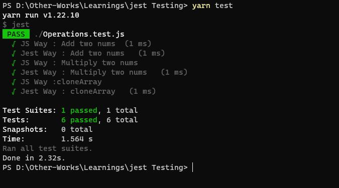
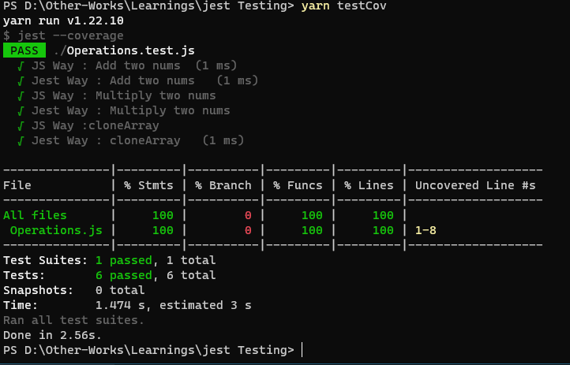

# Jest-JavaScript-Testing
Testing JS using 'Jest' a JS testing framework


## Tech Used 
&nbsp;
  

### pre-requisites
#### Base Reqs.
  Node.js  
  Jest Library
 
  
#### Libraries/modules
##### run ```yarn install``` or ```npm install``` inside auth-client dir. to install them  
  yarn/npm  
  jest  
  
    
  
## How to run
Clone this repo  

```
yarn install
yarn test
```
#### For Test Coverage Insights
```
yarn testCov
```

## Test OP 
### Test results
  
  
### Test results with Code Coverage
  

###### Look Up coverage\lcov-report\index.html for more insights on lines of code, functions, statements tested.